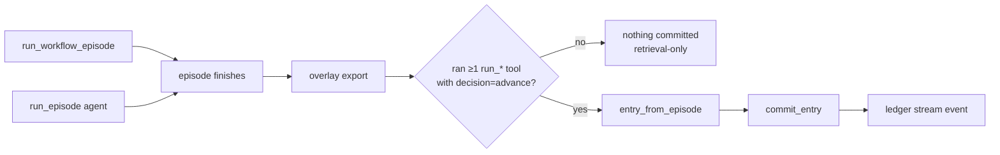
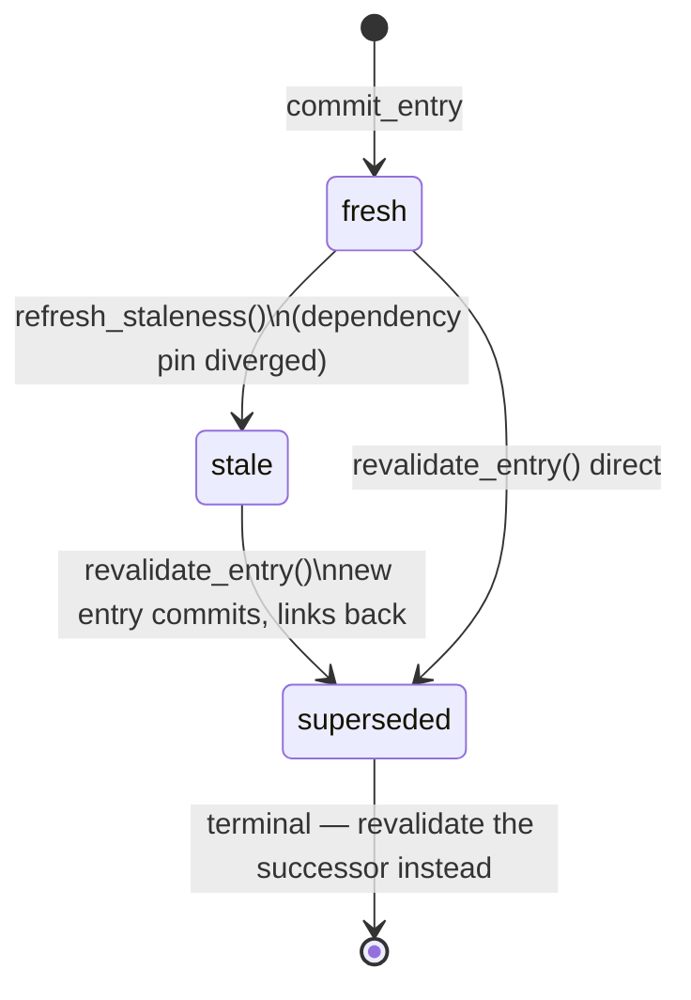

# Wayne Study Ledger — As-Built Architecture

**Status:** as-built reference for what is on `main` as of 2026-07-21
(PR #17, commits `c5aba4d` + `6fa4152`). The companion
`wayne-study-ledger-brief.md` (v2) is the *design* document — where the two
disagree, the brief describes intent and this file describes reality.
Update this file when the ledger code changes.

---

## 1. One-paragraph summary

The ledger is Wayne's system of record for grid analysis: an append-only,
immutable store of **entries**, one per committed study. Both episode paths
(fixed workflow and free-form agent) commit automatically when they ran at
least one study tool. Entries pin their dependencies (snapshot manifest
hash, workflow spec hash, tool versions) at commit time; a lazy staleness
pass compares those pins against the current world at the start of both
episode paths and via the CLI (`query_ledger` itself does **not** refresh —
see §7), and a revalidation write path re-runs stale workflow entries,
linking old ⇢ new with a `conclusion_changed` verdict. The agent
reads the ledger through the `query_ledger` tool and is instructed to cite
fresh prior findings instead of re-running identical studies.

## 2. Module map

| module | package | role |
|---|---|---|
| `gridagent_tools/ledger.py` | tools | storage substrate, entry schema, status-event overlay, `query_ledger` tool |
| `gridagent_orchestrator/ledger_commit.py` | orchestrator | entry ⇔ commit rule: episode JSONL → entry dict |
| `gridagent_orchestrator/ledger_revalidation.py` | orchestrator | staleness detection, lazy refresh, revalidation write path, `gridagent-ledger` CLI |
| `gridagent_orchestrator/run.py` | orchestrator | wiring: `_refresh_ledger_staleness()` at episode start, `_commit_to_ledger()` after overlay export, `ledger` stream event |
| `gridagent_orchestrator/planner.py` | orchestrator | `query_ledger` exposed to the agent; consult-the-record-first instruction |

Tests: `platform/tools/tests/test_ledger.py`,
`platform/orchestrator/tests/test_ledger_commit.py`,
`platform/orchestrator/tests/test_ledger_revalidation.py`.

## 3. Storage layout

```
$GRIDAGENT_DATA_ROOT/ledger/
├── entries.jsonl         # one JSON entry per line, append-only, IMMUTABLE
└── status_events.jsonl   # append-only status flips, overlaid at read time
```

Design properties, all load-bearing:

- **Append-only via `O_APPEND`** — single-syscall line writes stay atomic
  across the concurrent orchestrator subprocesses the web bridge spawns.
  No locks, no database server.
- **Entries never mutate.** Staleness and supersession are *events* on the
  side file; `load_entries()` overlays the latest event state onto
  `entry["status"]` at read time. The entry line you committed is the
  entry line forever.
- **SQL-queryable for free** — duckdb's `read_json_auto` works directly on
  the JSONL; no import step.
- **Deliberately replaceable substrate** (brief §10): all consumers go
  through `commit_entry` / `load_entries` / `query_ledger`, so swapping
  the file for a database is a one-module change.

## 4. Entry schema

```jsonc
{
  "entry_id": "769052094c984f5c",          // filled by commit_entry
  "committed_at": "2026-07-21T05:12:00+00:00",
  "subject":     { "subsystem": { "kind": "elements|system",
                                  "buses": ["309"], "branches": [] } },
  "question":    { "intent": "injection_study", "text": "<goal text>" },
  "model_state": { "snapshot_id": "snapshot_20260415_rts_gmlc",
                   "snapshot_manifest_sha256": "86b0…",   // dependency pin
                   "change_table": { "add_injection": { "309": 250.0 } } },
  "method":      { "type": "workflow|agent",
                   "name": "injection_study",             // workflow only
                   "spec_sha256": "00fe…",                // dependency pin
                   "inputs": { "bus_id": "309", "p_mw": 250 }, // re-run recipe
                   "model": "gemma4:26b",                 // agent only
                   "tool_versions": { "gridagent-tools": "0.1.0", … } }, // pins
  "results":     { "studies": [ { "tool": "run_injection_study",
                                  "arguments": {…}, "signal": {…} } ],
                   "summary": "<rendered or agent-written summary>" },
  "trace":       { "episode_id": "e5137cedc18c",
                   "episode_log": "episodes/episode_….jsonl" },
  "status":      { "stale": false, "supersedes": null, "superseded_by": null },
  "governance":  { "owner": "", "tenant": "", "visibility": "private",
                   "licenses": [] }        // reserved (brief §9), unenforced
}
```

`commit_entry` refuses entries missing any of the six required parts
(subject, question, model_state, method, results, trace) rather than
recording an unusable row. `model_id` (content-hash model identity, brief
§2) is deliberately absent in v1 — snapshots are the only model kind, and
snapshot_id + manifest hash stand in until the model store facet exists.

## 5. Write path — the entry ⇔ commit rule



Rules implemented in `ledger_commit.entry_from_episode`:

- **Commit iff a study ran**: at least one `run_*` step with verifier
  decision `advance`. Episodes that only listed snapshots or queried the
  ledger are retrieval, not studies — they cite the record, never enter it.
- **Last-advance wins — per tool name** (v1 limitation): a retried study
  tool commits only its final ADVANCEd attempt, but the dedup key is the
  tool name, so two *legitimate* `run_injection_study` calls in one
  episode (e.g. two buses) also collapse to the last. Multi-instance
  studies need either per-call keying or separate episodes today.
- **Sub-solves are trace, not entries**: the episode JSONL stays the
  step-level record; `trace.episode_log` points at it.
- **Scenario-less injection studies synthesize their delta**: a
  `run_injection_study(bus_id, p_mw)` with no scenario records
  `{"add_injection": {bus_id: p_mw}}` as the model-state change table.
- **Dependency pinning at commit**: snapshot manifest sha256, workflow
  spec sha256 (hash of the YAML file bytes), resolved workflow inputs
  (the verbatim re-run recipe), and installed package versions.
- **Never fails the study**: `run.py::_commit_to_ledger` wraps the commit;
  a ledger error emits a note and the run still succeeds — the episode
  log remains the fallback record.

## 6. Read path — `query_ledger`

Registered as a tool (usable by the agent and any registry consumer).
Filters: `intent`, `bus_id`, `branch_id`, `snapshot_id`, free-text
`text`, plus `include_stale` and `limit`.

Semantics that exist because live agent runs demanded them:

- **Intent is a soft filter.** Models phrase intents loosely (a live gemma
  run passed `intent="adding generation"` for an injection study).
  Matching normalizes and accepts substring overlap both ways; if the
  intent still eliminates everything while other filters matched, the
  intent is dropped and the result carries `intent_relaxed: true`.
- **System-wide entries match any element filter** — a whole-grid DC OPF
  is a hit for "what do we know about bus 309".
- **Stale entries hide by default** but are counted: `n_stale_hidden` in
  the result signals that prior-but-outdated knowledge exists — invisible
  staleness would silently truncate the record. Note: staleness flags are
  only as fresh as the last `refresh_staleness()` pass; `query_ledger`
  itself does not refresh, so direct registry consumers outside an episode
  can see stale-but-unmarked entries (§7).
- **The planner wrapper exposes a subset**: the agent gets `intent`,
  `bus_id`, `branch_id`, `text` only. `snapshot_id`, `include_stale`, and
  `limit` exist on the core tool but are not agent-reachable today — the
  agent can *see* `n_stale_hidden` but cannot re-query with
  `include_stale` itself.
- Results are newest-first summaries: intent, question, subsystem, method,
  per-study signals, truncated summary, staleness state.

## 7. Lifecycle — staleness and supersession



**Staleness detection** (`staleness_reasons`) compares the three pins:
snapshot manifest hash changed or snapshot gone; workflow spec hash
changed or spec gone; any pinned tool version differing from the installed
one. Unpinned dependencies never flag — absence of evidence is not
divergence.

**Lazy, per brief §6 decision**: `refresh_staleness()` is a flag-flip pass
(hashing only, no solves) called from exactly three places: the start of
`run_episode`, the start of `run_workflow_episode`, and the
`gridagent-ledger refresh` CLI. It is **not** invoked by `query_ledger`,
so a registry consumer querying outside an episode reads flags as of the
last refresh. Already stale/superseded entries are skipped so the event
log doesn't grow on re-checks.

**Revalidation** (`revalidate_entry`):

1. Refuses unknown entries, already-superseded entries (revalidate the
   successor), and non-workflow methods — an agent episode's method is the
   planner itself, so re-running one is a deliberate action, not a ledger
   mechanism (v1 scope).
2. Re-executes the workflow with the entry's pinned `method.inputs`
   through the **normal** episode path — so the new entry gets today's
   pins, its own episode trace, and its own overlay export.
3. Diffs conclusions (`conclusions_differ`): signals paired by tool;
   numeric drift within 1% relative is solver noise, any flag/status flip
   or added/removed tool is a changed conclusion. (Threshold explicitly
   provisional — brief §6 keeps it open.)
4. Appends `superseded/supersedes` status events carrying
   `conclusion_changed` — the learning outcome signal of brief §7: process
   knowledge whose conclusions survive revalidation earns confidence.

**CLI**: `gridagent-ledger refresh` (flag pass, prints newly stale) and
`gridagent-ledger revalidate <entry_id>` (write path, prints the link).

## 8. Agent integration

- `query_ledger` is exposed as a planner tool with a one-shot loop guard.
- Planner instructions open every episode with: list snapshots, then query
  the ledger with the study intent and subject; **cite a fresh equivalent
  entry instead of re-running the same study**; run anew only if the
  question, subject, or scenario differs or the entry is stale.
- Verified live: "Has anyone studied adding generation at bus 309?" was
  answered from the ledger with the prior entry's exact numbers, zero
  solver calls, and no spurious commit.

## 9. Invariants (the contract tests enforce)

1. An entry line, once written, is never modified or deleted.
2. Every status change is an append-only event; state is a read-time fold.
3. Ledger failures never fail a study run.
4. Only episodes that ran a study tool commit; retrieval-only never does.
5. A superseded entry is terminal; its successor carries the live claim.
6. Workflow entries committed through the episode paths pin their
   resolved inputs and are re-executable from the method block alone;
   entries lacking pinned inputs (direct `commit_episode` callers) are
   refused by revalidation rather than re-run with defaults. Staleness is
   decidable from any entry's own pins.
7. Stale entries are hidden from default queries but never invisible
   (`n_stale_hidden`).

## 10. Not built yet (design only — brief references)

| concept | brief § | status |
|---|---|---|
| Dossiers (frozen entry sets) + artifacts table | §4 | not started |
| Process register (object/process knowledge split, confidence grades) | §7 | not started; workflow registry + trajectory_store are the embryos |
| Governance enforcement (tenant/visibility/licenses) | §9 | fields reserved on every entry, nothing reads them |
| Model ids / packages / subsystem registry / common-properties layer | §2 | snapshot_id + manifest hash stand in |
| Embedding retrieval | §10 | keyword + filter matching only |
| Agent-episode revalidation | §6 | explicitly out of v1 scope |
| Conclusion-diff thresholds per study type | §6 | single global 1% relative tolerance |
